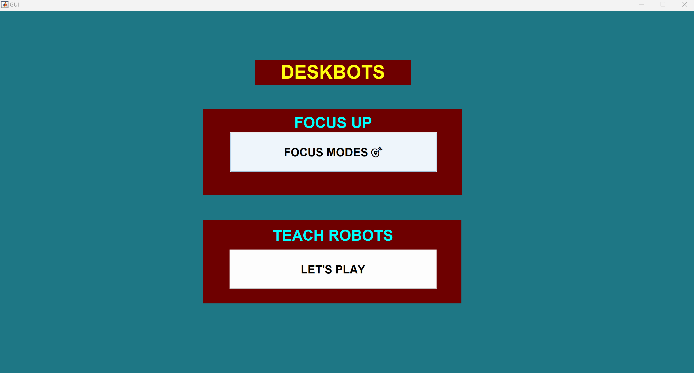

# SafeCo_PPRobo - README

    Git Repo for Code and File Base for Pick & Place Robot

&nbsp;

# INSTRUCTIONS TO OPEN AND RUN CODE:

    Open Assessment2.m and run

&nbsp;

# MODES INVOLVED:

    A. Focus Modes - Choose between Maths, Physics & Chemistry focus modes
    B. Teach Mode - Jog between two robots, move them either in joint state or cartesian state

&nbsp;

&nbsp;

# ADDITIONAL NOTE:

Links for the webpages from where the 3D Models were sourced and utilised for this project are provided in the following file of directory:

    "./3D Models/modRef.txt"

